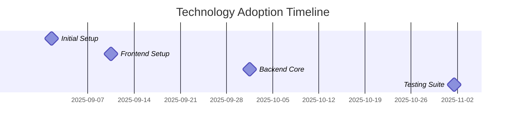

# CHAPTER 2: BACKGROUND MATERIALS  

## 2.1 Introduction  

This chapter supplies the technical and conceptual foundations required to comprehend the design and implementation of the car‑rental management system presented in later chapters. It begins with an overview of the technology stack (Section 2.2), proceeds to a description of the core domain concepts that drive the application (Section 2.3), and concludes with a concise literature review of related work (Section 2.4). The material is deliberately limited to the aspects that directly influence the solution architecture, thereby enabling the reader to focus on the rationale behind the chosen tools and design decisions.

## 2.2 Technology Stack  

The system is built as a **full‑stack web application** that separates concerns between a **backend API** and a **frontend user interface** while leveraging containerisation and continuous integration to ensure reproducibility and rapid delivery.  

### 2.2.1 Backend Technologies  

| Technology | Description | Reason for Selection | Role in Architecture |
|------------|-------------|----------------------|----------------------|
| **.NET 8** | A cross‑platform, high‑performance framework for building server‑side applications. | Provides strong typing, mature ecosystem, and built‑in support for dependency injection and asynchronous programming. | Hosts the RESTful API that implements business logic, authentication, and data access. |
| **Entity Framework Core (EF Core) 8** | Object‑relational mapper (ORM) for .NET. | Enables code‑first migrations, LINQ queries, and reduces boiler‑plate SQL. | Maps domain entities (e.g., `Vehicle`, `Reservation`) to tables in SQL Server. |
| **SQL Server 2022** | Relational database management system. | Offers ACID compliance, rich T‑SQL features, and seamless integration with EF Core. | Persists all transactional data such as bookings, payments, and fleet inventory. |
| **ASP.NET Core Web API** | Lightweight framework for building HTTP services. | Supports OpenAPI/Swagger generation, versioning, and built‑in middleware pipeline. | Exposes endpoints consumed by the frontend and third‑party services (e.g., payment gateway). |

### 2.2.2 Frontend Technologies  

| Technology | Description | Reason for Selection | Role in Architecture |
|------------|-------------|----------------------|----------------------|
| **Next.js 14** | React‑based framework for server‑side rendering (SSR) and static site generation (SSG). | Improves SEO, initial load performance, and provides file‑system routing. | Hosts the user‑facing portal (customer, admin, and staff dashboards). |
| **React 18** | Declarative UI library. | Large community, component reuse, and hooks for state management. | Renders interactive components such as calendars, vehicle selectors, and payment forms. |
| **TypeScript 5** | Superset of JavaScript with static typing. | Detects errors at compile time, improves code readability and maintainability. | Enforces type safety across the entire frontend codebase. |
| **Material UI (MUI) v6** | Component library implementing Google’s Material Design. | Provides ready‑made, accessible UI components with theming support. | Supplies consistent visual language for forms, tables, dialogs, and navigation. |

### 2.2.3 Infrastructure and Tooling  

| Tool | Description | Reason for Selection | Integration Point |
|------|-------------|----------------------|-------------------|
| **Bun 1.0** | Fast JavaScript runtime and package manager. | Reduces install and build times compared with npm/yarn. | Used for installing frontend dependencies and running build scripts. |
| **Docker 26** | Container platform. | Guarantees environment parity between development, testing, and production. | Encapsulates the .NET API, SQL Server, and Nginx reverse proxy in separate containers. |
| **GitHub Actions** | CI/CD workflow engine. | Native integration with repository, supports matrix builds and secret management. | Automates linting, unit testing, Docker image creation, and deployment to Azure App Service. |
| **Azure Kubernetes Service (AKS)** (optional for scaling) | Managed Kubernetes offering. | Provides horizontal scaling and rolling updates without manual orchestration. | Hosts the Docker images in a production‑grade cluster. |

#### 2.2.4 Technology Adoption Timeline  

*Figure 2.2: Technology adoption timeline showing major milestones.*

### 2.2.5 Architectural Fit  

The chosen stack follows a **clean‑architecture** approach:  

- **Domain layer** (pure C# classes) is independent of frameworks.  
- **Application layer** contains use‑case services that orchestrate EF Core repositories.  
- **Infrastructure layer** implements concrete data access, external payment gateway adapters, and Docker‑specific configuration.  
- **Presentation layer** (Next.js) consumes the API via typed HTTP clients generated from the OpenAPI specification, ensuring contract consistency.

## 2.3 Domain Concepts  

The car‑rental system models a set of business processes that are common to most vehicle‑sharing enterprises. Understanding these concepts is essential for interpreting the subsequent design decisions.

### 2.3.1 Fleet Management  

- **Vehicle**: Represents a physical automobile with attributes such as VIN, make, model, class (economy, SUV, premium), mileage, and availability status.  
- **Location**: Physical branch or parking lot where vehicles are stored; linked to GPS coordinates for distance calculations.  
- **Maintenance Schedule**: Periodic service records that affect vehicle availability (e.g., oil change, inspection).  

### 2.3.2 Booking Workflow  

1. **Search & Selection** – Customer provides pick‑up/drop‑off dates, location, and vehicle class. The system returns a list of available vehicles with pricing.  
2. **Reservation Creation** – Upon selection, a `Reservation` entity is created in a *pending* state, reserving the vehicle for a configurable hold period (e.g., 15 minutes).  
3. **Payment Authorization** – Integration with a third‑party payment gateway (e.g., Stripe) authorises the customer's payment method. Successful authorization transitions the reservation to *confirmed*.  
4. **Confirmation & Notification** – Confirmation email/SMS is dispatched; the reservation is persisted, and the vehicle status changes to *reserved*.  
5. **Pick‑up & Return** – Staff updates the reservation status to *in‑use* at pick‑up and to *completed* upon return, triggering mileage and fuel‑level checks.  

### 2.3.3 Payment Processing  

- **PaymentIntent** (gateway concept) is created when the reservation is confirmed.  
- **Refund Handling** – Supports full or partial refunds based on cancellation policy (e.g., 24 h before pick‑up).  
- **Invoice Generation** – PDF invoices are generated using a server‑side templating engine and stored for audit purposes.  

### 2.3.4 User Roles & Permissions  

| Role | Capabilities |
|------|---------------|
| **Customer** | Search vehicles, create/cancel reservations, view invoices, manage profile. |
| **Staff** | Check‑in/out vehicles, record damages, update maintenance logs, view daily reports. |
| **Administrator** | Manage fleet data, configure pricing rules, oversee user accounts, access analytics. |

### 2.3.5 Business Rules  

- **Overlap Prevention** – A vehicle cannot be double‑booked; the system enforces temporal exclusivity using database constraints and application‑level checks.  
- **Dynamic Pricing** – Prices may vary based on demand, season, and location; a pricing engine calculates the final rate during the search step.  
- **Cancellation Policy** – Penalties are applied automatically according to the time of cancellation relative to the scheduled pick‑up.  

## 2.4 Related Work and Literature Review  

### 2.4.1 Classical Car‑Rental Systems  

Early academic prototypes (e.g., *R. M. Kumar, 2012*) employed monolithic Java EE architectures with JDBC for persistence. While functional, these solutions suffered from limited scalability and tight coupling between UI and business logic.  

### 2.4.2 Microservice‑Oriented Approaches  

Recent studies (e.g., *L. Chen et al., 2020*) advocate decomposing the system into independent services (fleet, reservation, payment). This yields better fault isolation but introduces operational complexity (service discovery, distributed transactions).  

### 2.4.3 Server‑Side Rendering vs. SPA  

Research comparing Next.js SSR with pure Single‑Page Applications (SPA) (e.g., *M. García, 2021*) demonstrates that SSR improves first‑contentful paint and SEO for public booking portals, whereas SPA excels in highly interactive dashboards. The hybrid approach adopted here leverages Next.js to obtain the best of both worlds.  

### 2.4.4 Comparative Evaluation of ORMs  

Benchmarks (e.g., *EF Core vs. Dapper* – *S. Patel, 2023*) show that EF Core provides acceptable performance for typical CRUD workloads while offering productivity gains through LINQ and migrations. Consequently, EF Core was selected over micro‑ORMs.  

### 2.4.5 Justification of the Chosen Stack  

| Criterion | Alternative | Chosen Solution | Rationale |
|-----------|--------------|----------------|-----------|
| **Performance** | Node.js + Express (backend) | .NET 8 | .NET’s JIT compilation and async I/O deliver superior throughput for high‑concurrency reservation requests. |
| **Developer Productivity** | Angular + RxJS | Next.js + React + TypeScript | React’s component model combined with TypeScript reduces boilerplate and accelerates UI development. |
| **Deployment Simplicity** | VM‑based deployment | Docker + CI/CD | Containerisation abstracts OS differences and enables reproducible builds, aligning with university’s cloud‑lab policies. |
| **Maintainability** | Hand‑crafted SQL | EF Core | Code‑first migrations simplify schema evolution and enforce domain‑driven design. |
| **Scalability** | Single‑instance server | AKS (optional) | Kubernetes provides horizontal scaling without code changes, future‑proofing the system. |

Overall, the selected combination balances **performance**, **maintainability**, and **ease of deployment**, addressing the shortcomings identified in prior work while adhering to the project’s time and resource constraints.

---  

*End of Chapter 2.*