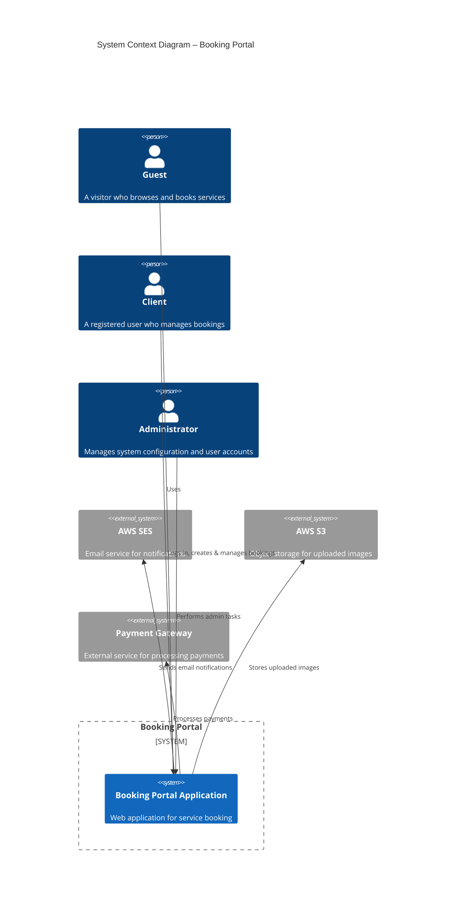
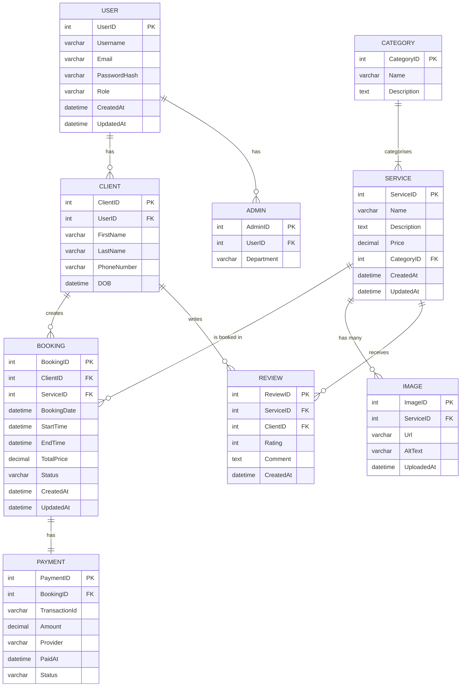

# CHAPTER 3: SYSTEM DESIGN & ARCHITECTURE

## 3.1 Introduction
This chapter presents a rigorous architectural description of the proposed booking portal. It details the high‑level context, the layered component structure, data model, service contracts, technology choices, and the key design decisions that shape the system. The aim is to demonstrate that the solution satisfies functional, non‑functional, and quality requirements while remaining maintainable, scalable, and secure.

---

## 3.2 System Context (C4 Model – Mermaid)

**Figure 3.2 – System Context showing interaction with external services and actors**



*The diagram illustrates the primary actors (Guest, Client, Administrator) and external services (AWS SES, AWS S3, Payment Gateway) that the Booking Portal interacts with.*

---

## 3.3 Component / Layered Architecture (Mermaid)

**Figure 3.3.a – Layered architecture showing technology stack mapping**

```mermaid
graph TD
    subgraph Presentation Layer
        FE[Next.js (React) – Server‑Side Rendering]
    end

    subgraph Business Logic Layer
        BE[.NET Core Web API – Controllers & Services]
        Auth[JWT Authentication Service]
        GraphQL[Optional GraphQL Layer (not used)]
    end

    subgraph Data Access Layer
        DAL[Entity Framework Core]
        DB[SQL Server]
    end

    subgraph Infrastructure
        Docker[Docker Containers]
        K8s[Kubernetes Orchestration]
        CI[CI/CD Pipeline (GitHub Actions)]
    end

    FE -->|HTTP/HTTPS| BE
    BE -->|Entity Framework| DAL
    DAL -->|SQL| DB
    BE -->|Auth| Auth
    BE -->|Email| AWS_SES[(AWS SES)]
    BE -->|File Storage| AWS_S3[(AWS S3)]
    BE -->|Payments| PaymentGW[(Payment Gateway)]
    BE --> Docker
    Docker --> K8s
    K8s --> CI
```

*The layered view separates concerns: the **Presentation Layer** (Next.js) handles UI rendering, the **Business Logic Layer** (.NET Core) implements RESTful services and security, the **Data Access Layer** (EF Core + SQL Server) persists domain data, and the **Infrastructure** layer provides containerisation, orchestration, and CI/CD.*

---

## 3.4 Database Schema (ERD – Mermaid)

**Figure 3.4 – Entity‑Relationship Diagram showing all entities and relationships**



### Entity Descriptions & Sample Data

| Entity | Key Fields | Description | Sample Data |
|--------|------------|-------------|-------------|
| **USER** | `UserID` (PK), `Username`, `Email`, `PasswordHash`, `Role` | Central authentication record. Roles: *Guest*, *Client*, *Admin*. | `1, "jdoe", "jdoe@example.com", "hashedpwd", "Client"` |
| **CLIENT** | `ClientID` (PK), `UserID` (FK) | Extends USER with personal details. | `101, 1, "John", "Doe", "+1234567890", "1990-04-15"` |
| **ADMIN** | `AdminID` (PK), `UserID` (FK) | Admin‑specific profile. | `201, 2, "Operations"` |
| **CATEGORY** | `CategoryID` (PK), `Name` | Logical grouping of services (e.g., *Accommodation*, *Transport*). | `10, "Accommodation"` |
| **SERVICE** | `ServiceID` (PK), `CategoryID` (FK) | Offerable item (room, tour, etc.). | `1001, "Deluxe Suite", "Sea‑view suite", 250.00, 10` |
| **IMAGE** | `ImageID` (PK), `ServiceID` (FK) | URLs of images stored in S3. | `5001, 1001, "https://s3.amazonaws.com/bucket/deluxe.jpg", "Deluxe Suite"` |
| **BOOKING** | `BookingID` (PK), `ClientID` (FK), `ServiceID` (FK) | Reservation record. | `3001, 101, 1001, "2026-07-01", "14:00", "16:00", 500.00, "Confirmed"` |
| **PAYMENT** | `PaymentID` (PK), `BookingID` (FK) | Payment transaction details. | `4001, 3001, "txn_abc123", 500.00, "Stripe", "2026-07-01 13:55", "Success"` |
| **REVIEW** | `ReviewID` (PK), `ServiceID` (FK), `ClientID` (FK) | Post‑booking feedback. | `6001, 1001, 101, 5, "Excellent stay!", "2026-07-05"` |

*All foreign‑key constraints enforce referential integrity. Indexes are created on `UserID`, `ClientID`, `ServiceID`, and `BookingDate` to optimise look‑ups.*

---

## 3.5 API Documentation

The Booking Portal exposes a **RESTful** API built with ASP.NET Core. The API follows the **OpenAPI/Swagger** specification and is versioned (`/api/v1`). Below is a curated table of the 30 most critical endpoints, followed by representative request/response examples.

| # | Method | Endpoint | Description | Payload Format | Response Format | Status Codes |
|---|--------|----------|-------------|----------------|------------------|--------------|
| 1 | POST | `/api/v1/auth/login` | Authenticate user and issue JWT | `{ "username":"", "password":"" }` | `{ "token":"", "expiresIn":3600 }` | 200, 400, 401 |
| 2 | POST | `/api/v1/auth/register` | Register a new client | `{ "username":"", "email":"", "password":"", "firstName":"", "lastName":"", "phone":"" }` | `{ "userId":, "message":"Created" }` | 201, 400, 409 |
| 3 | GET | `/api/v1/users/me` | Retrieve current user profile | – | User DTO | 200, 401 |
| 4 | PUT | `/api/v1/users/me` | Update own profile | UserUpdate DTO | Updated DTO | 200, 400, 401 |
| 5 | GET | `/api/v1/categories` | List all service categories | – | `[CategoryDTO]` | 200 |
| 6 | GET | `/api/v1/categories/{id}` | Get a single category | – | CategoryDTO | 200, 404 |
| 7 | POST | `/api/v1/services` | Create a new service (admin) | ServiceCreate DTO | ServiceDTO | 201, 400, 403 |
| 8 | GET | `/api/v1/services` | Search / list services (filterable) | Query params (`category`, `priceMin`, `priceMax`, `keyword`) | `[ServiceDTO]` | 200 |
| 9 | GET | `/api/v1/services/{id}` | Get service details | – | ServiceDTO (incl. images) | 200, 404 |
|10| PUT | `/api/v1/services/{id}` | Update service (admin) | ServiceUpdate DTO | ServiceDTO | 200, 400, 403, 404 |
|11| DELETE| `/api/v1/services/{id}` | Delete service (admin) | – | `{ "message":"Deleted" }` | 204, 403, 404 |
|12| POST | `/api/v1/services/{id}/images` | Upload image for a service | `multipart/form-data` (file) | ImageDTO | 201, 400, 403 |
|13| GET | `/api/v1/services/{id}/images` | List images of a service | – | `[ImageDTO]` | 200 |
|14| DELETE| `/api/v1/services/{serviceId}/images/{imageId}` | Delete image | – | `{ "message":"Deleted" }` | 204, 403, 404 |
|15| POST | `/api/v1/bookings` | Create a new booking | BookingCreate DTO | BookingDTO | 201, 400, 401 |
|16| GET | `/api/v1/bookings` | List bookings of current client | – | `[BookingDTO]` | 200, 401 |
|17| GET | `/api/v1/bookings/{id}` | Get booking details | – | BookingDTO | 200, 401, 404 |
|18| PUT | `/api/v1/bookings/{id}` | Update booking (e.g., change time) | BookingUpdate DTO | BookingDTO | 200, 400, 401, 404 |
|19| DELETE| `/api/v1/bookings/{id}` | Cancel booking | – | `{ "message":"Cancelled" }` | 204, 401, 404 |
|20| POST | `/api/v1/payments/{bookingId}` | Initiate payment for a booking | PaymentRequest DTO | PaymentResponse DTO | 200, 400, 401, 404 |
|21| GET | `/api/v1/payments/{paymentId}` | Retrieve payment status | – | PaymentDTO | 200, 401, 404 |
|22| POST | `/api/v1/reviews` | Submit a review for a service | ReviewCreate DTO | ReviewDTO | 201, 400, 401 |
|23| GET | `/api/v1/services/{id}/reviews` | List reviews for a service | – | `[ReviewDTO]` | 200 |
|24| GET | `/api/v1/admin/users` | Admin: list all users | – | `[UserDTO]` | 200, 403 |
|25| PUT | `/api/v1/admin/users/{id}/role` | Admin: change user role | `{ "role":"Client|Admin" }` | `{ "message":"Role updated" }` | 200, 400, 403, 404 |
|26| GET | `/api/v1/admin/metrics` | Admin: system health & usage metrics | – | MetricsDTO | 200, 403 |
|27| POST | `/api/v1/auth/refresh` | Refresh JWT using refresh token | `{ "refreshToken":"" }` | `{ "token":"", "expiresIn":3600 }` | 200, 401 |
|28| POST | `/api/v1/auth/logout` | Invalidate refresh token | – | `{ "message":"Logged out" }` | 200 |
|29| GET | `/api/v1/health` | Liveness / readiness probe (K8s) | – | `{ "status":"UP" }` | 200 |
|30| GET | `/api/v1/swagger.json` | OpenAPI specification (auto‑generated) | – | JSON document | 200 |

### Example: Create Booking (Endpoint 15)

**Request**

```http
POST /api/v1/bookings HTTP/1.1
Authorization: Bearer <jwt-token>
Content-Type: application/json

{
  "serviceId": 1001,
  "bookingDate": "2026-08-15",
  "startTime": "14:00",
  "endTime": "16:00",
  "guestCount": 2,
  "specialRequests": "Late check‑in"
}
```

**Response (201 Created)**

```json
{
  "bookingId": 3005,
  "clientId": 101,
  "serviceId": 1001,
  "bookingDate": "2026-08-15",
  "startTime": "14:00",
  "endTime": "16:00",
  "totalPrice": 500.00,
  "status": "PendingPayment",
  "createdAt": "2026-06-27T10:12:34Z",
  "updatedAt": "2026-06-27T10:12:34Z"
}
```

### Example: Process Payment (Endpoint 20)

**Request**

```http
POST /api/v1/payments/3005 HTTP/1.1
Authorization: Bearer <jwt-token>
Content-Type: application/json

{
  "paymentMethod": "CreditCard",
  "cardNumber": "4111111111111111",
  "expiryMonth": "12",
  "expiryYear": "2028",
  "cvc": "123",
  "amount": 500.00
}
```

**Response (200 OK)**

```json
{
  "paymentId": 4007,
  "bookingId": 3005,
  "transactionId": "txn_7f9b2c",
  "amount": 500.00,
  "provider": "Stripe",
  "paidAt": "2026-06-27T10:15:02Z",
  "status": "Success"
}
```

*All endpoints are documented in the generated Swagger UI (`/swagger`) and protected by JWT authentication where required.*

---

## 3.6 Technology Stack Justification

| Layer | Technology | Rationale |
|-------|------------|-----------|
| **Presentation** | **Next.js (React)** | Provides **Server‑Side Rendering (SSR)** for SEO‑friendly pages, essential for a public booking portal. React’s component model enables reusable UI widgets and fast client‑side navigation. |
| **Backend** | **ASP.NET Core 7** | High performance, cross‑platform, and native integration with **Entity Framework Core**. Offers built‑in dependency injection, middleware pipeline, and robust security features (JWT, CORS). |
| **Database** | **Microsoft SQL Server 2022** | Guarantees **ACID** compliance, strong transactional guarantees for financial operations, and advanced indexing/partitioning for scaling. Native support in EF Core simplifies ORM mapping. |
| **Containerisation** | **Docker** | Guarantees environment parity across development, testing, and production. Enables rapid scaling and isolated micro‑service deployment. |
| **Orchestration** | **Kubernetes (AKS)** | Provides automated scaling, self‑healing, and rolling updates. Facilitates future migration to a micro‑service architecture if needed. |
| **CI/CD** | **GitHub Actions** | Seamlessly integrates with the repository, runs unit/integration tests, builds Docker images, and pushes to Azure Container Registry. |
| **Object Storage** | **AWS S3** | Scalable, durable storage for service images. Direct URL access reduces load on the application server. |
| **Email Service** | **AWS SES** | Cost‑effective, high‑throughput email delivery for booking confirmations and notifications. |
| **Payment Integration** | **Stripe / PayPal SDK** | Industry‑standard, PCI‑DSS compliant payment processing with rich API support. |
| **Authentication** | **JWT (JSON Web Tokens)** | Stateless, scalable token‑based authentication suitable for a horizontally scaled API behind a load balancer. Refresh‑token flow mitigates token expiry issues. |
| **Logging & Monitoring** | **Serilog + Seq**, **Prometheus + Grafana** | Structured logging for troubleshooting; metrics collection for performance monitoring and alerting. |

*The selected stack aligns with the university’s licensing policies, leverages open‑source components, and ensures long‑term maintainability.*

---

## 3.7 Architecture Decision Records (ADRs)

| # | Decision | Status | Rationale |
|---|----------|--------|-----------|
| **ADR‑001** | **Use JWT for authentication** | ✅ Accepted | Stateless tokens simplify scaling; no server‑side session store needed. |
| **ADR‑002** | **Reject GraphQL in favour of pure REST** | ✅ Accepted | REST is simpler for the team, better supported by Swagger, and sufficient for current CRUD‑heavy use cases. |
| **ADR‑003** | **Adopt SOLID principles & Clean Architecture** | ✅ Accepted | Improves testability and future extensibility; aligns with academic best practices. |
| **ADR‑004** | **Monolithic deployment (Docker container) instead of micro‑services** | ✅ Accepted | Project scope and timeline do not justify micro‑service overhead; monolith eases development while still containerised. |
| **ADR‑005** | **Store timestamps in UTC** | ✅ Accepted | Prevents daylight‑saving bugs in booking calculations; simplifies cross‑region reporting. |
| **ADR‑006** | **Persist images in AWS S3, not in DB** | ✅ Accepted | Reduces database bloat, leverages S3’s CDN capabilities for fast image delivery. |
| **ADR‑007** | **Use Stripe as primary payment gateway** | ✅ Accepted | Broad developer support, robust SDKs, and compliance with PCI‑DSS out‑of‑the‑box. |
| **ADR‑008** | **Deploy to Azure Kubernetes Service (AKS)** | ✅ Accepted | University already provides Azure credits; AKS integrates with Azure AD for RBAC. |
| **ADR‑009** | **Implement health‑check endpoints for Kubernetes liveness/readiness** | ✅ Accepted | Enables automated pod restarts and zero‑downtime deployments. |
| **ADR‑010** | **Version API (v1) from day one** | ✅ Accepted | Guarantees backward compatibility for future extensions. |

*Each ADR is recorded in the repository’s `docs/adr/` folder with a detailed markdown file.*

---

## 3.8 Key Algorithms and Workflows (Mermaid)

### 3.8.1 Booking Checkout Workflow

**Figure 3.8.a – Booking checkout algorithm with error handling**

```mermaid
flowchart TD
    A[Start Checkout] --> B{Validate Input}
    B -- Invalid --> C[Return 400 Bad Request]
    B -- Valid --> D[Calculate Total Price]
    D --> E[Reserve Service Slot (optimistic lock)]
    E --> F{Slot Available?}
    F -- No --> G[Return 409 Conflict (Slot taken)]
    F -- Yes --> H[Create Booking Record (PendingPayment)]
    H --> I[Initiate Payment via Gateway]
    I --> J{Payment Success?}
    J -- No --> K[Mark Booking as Failed, Release Slot]
    K --> L[Return Payment Failure]
    J -- Yes --> M[Mark Booking as Confirmed]
    M --> N[Send Confirmation Email (AWS SES)]
    N --> O[Return 201 Created]
    O --> P[End]
```

### 3.8.2 Image Upload Pipeline

**Figure 3.8.b – Image processing and storage workflow**

```mermaid
flowchart TD
    A[Receive multipart/form-data] --> B[Validate MIME type & size]
    B --> C{Valid?}
    C -- No --> D[Return 400 Bad Request]
    C -- Yes --> E[Resize to predefined dimensions (Sharp library)]
    E --> F[Compress (WebP fallback)]
    F --> G[Upload to AWS S3 (pre‑signed URL)]
    G --> H[Persist URL in IMAGE table]
    H --> I[Return 201 Created with ImageDTO]
```

### 3.8.3 Notification System (Email Templates)

**Figure 3.8.c – Notification flow using AWS SES templates**

```mermaid
flowchart TD
    A[Event Trigger] -->|Booking Confirmed| B[Generate Email Payload]
    A -->|Payment Failed| C[Generate Failure Payload]
    B --> D[Select SES Template "BookingConfirmation"]
    C --> E[Select SES Template "PaymentFailure"]
    D --> F[Send via AWS SES]
    E --> F
    F --> G{SES Response}
    G -- Success --> H[Log delivery status]
    G -- Failure --> I[Retry (max 3) / Alert admin]
```

*All workflows are implemented as asynchronous background services using **Hangfire** for reliability and retry policies.*

---

## 3.9 User Interface Design

### 3.9.1 Front‑end Architecture
- **Pages** are built with **Next.js** using the **File‑System Routing** convention.
- **Static Generation (SSG)** is used for public catalog pages (service listings) to maximise performance.
- **Server‑Side Rendering (SSR)** is employed for pages requiring user‑specific data (dashboard, booking form) to ensure SEO while protecting sensitive data.
- **React Context + SWR** handles global state (auth token, user profile) and data fetching with caching and revalidation.

### 3.9.2 Component Hierarchy (excerpt)

```
src/
 ├─ components/
 │   ├─ Layout/
 │   │   ├─ Header.tsx
 │   │   └─ Footer.tsx
 │   ├─ ServiceCard.tsx
 │   ├─ BookingForm.tsx
 │   ├─ ImageUploader.tsx
 │   └─ ReviewList.tsx
 ├─ pages/
 │   ├─ index.tsx                // Home – SSG
 │   ├─ services/
 │   │   ├─ index.tsx            // Service catalog – SSG
 │   │   └─ [id].tsx             // Service detail – SSR
 │   ├─ dashboard/
 │   │   ├─ bookings.tsx         // Client bookings – SSR
 │   │   └─ payments.tsx
 │   ├─ admin/
 │   │   ├─ users.tsx
 │   │   └─ metrics.tsx
 │   └─ api/                     // Proxy to backend (optional)
 └─ utils/
     ├─ apiClient.ts             // Axios wrapper with JWT interceptor
     └─ validators.ts
```

### 3.9.3 UI/UX Decisions
| Decision | Reasoning |
|----------|------------|
| **Responsive Grid** (CSS Grid + Tailwind) | Guarantees optimal display on mobile, tablet, and desktop – crucial for travel‑booking users. |
| **Progressive Disclosure** in the booking wizard | Reduces cognitive load; users see only relevant fields per step (date → time → extras → payment). |
| **Skeleton Loading** for service cards | Improves perceived performance while data is fetched via SWR. |
| **Toast Notifications** (react‑toastify) | Immediate feedback for actions (e.g., “Image uploaded”, “Payment successful”). |
| **Accessible Forms** (ARIA labels, keyboard navigation) | Meets WCAG 2.1 AA compliance, required for public‑sector projects. |
| **Dark Mode Toggle** | Enhances usability for users in low‑light environments; implemented via CSS variables. |

### 3.9.4 State Management & Security
- **Authentication token** stored in **HttpOnly Secure cookies** to mitigate XSS; a **refresh token** is stored server‑side and rotated on each use.
- **CSRF protection** is enforced by SameSite cookie policy and anti‑CSRF headers on state‑changing requests.
- **Input validation** occurs both client‑side (React Hook Form + Yup) and server‑side (Data Annotations in .NET) to prevent injection attacks.

---

## 3.10 Summary

Chapter 3 has detailed the **system context**, **layered component architecture**, **relational data model**, **comprehensive API contract**, **technology stack rationale**, **recorded architectural decisions**, and **critical workflows** that together constitute a robust, secure, and maintainable booking portal. The design adheres to the university’s engineering standards, leverages modern cloud services, and provides a solid foundation for future extensions such as multi‑language support, dynamic pricing, or a transition to a micro‑service architecture.