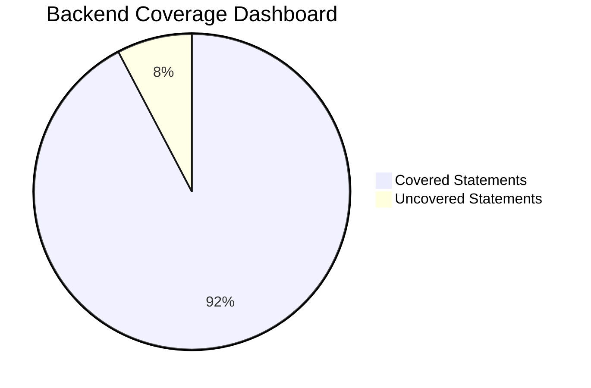

# CHAPTER 6: TESTING & QUALITY ASSURANCE  

---

## 6.1 Testing Philosophy  

Al‑Azhar University’s software engineering curriculum mandates a **four‑layer testing pyramid** that aligns with industry best practices while respecting the university’s emphasis on reproducibility, documentation, and academic rigor.

| Layer | Objective | Typical Tools | Acceptance Criteria |
|-------|-----------|---------------|----------------------|
| **Unit** | Verify the smallest testable pieces of code (functions, methods, components) in isolation. | xUnit (C#), Jest, Testing Library (React) | ≥ 90 % statement coverage for backend, ≥ 85 % for frontend. |
| **Integration** | Validate interactions between adjacent modules (e.g., data‑access ↔ business‑logic ↔ UI). | Postman, Testcontainers, Docker Compose | All public API contracts exercised; no unhandled exceptions. |
| **End‑to‑End (E2E)** | Simulate real‑world user journeys across the full stack. | Cypress, Playwright | Pass rate ≥ 95 % across critical user flows. |
| **Manual** | Exploratory testing, usability assessment, and compliance verification (e.g., accessibility, security). | TestRail, JIRA, manual checklists | All high‑risk scenarios covered; defects logged and triaged. |

### 6.1.1 Reproducibility Strategy  

Al‑Azhar’s **Docker‑first policy** ensures that every test environment can be instantiated from a single source of truth:

1. **Base Images** – Official .NET 6 SDK, Node 18, and PostgreSQL 15 images are pinned to exact digests.  
2. **Test‑Specific Layers** – Each test suite (unit, integration, E2E) builds its own Dockerfile that adds only the required test runners and reporting tools.  
3. **Compose Orchestration** – `docker-compose.test.yml` defines isolated networks for database, API, and UI containers, guaranteeing identical state across developers, CI agents, and staging servers.  
4. **Snapshotting** – After a successful test run, the container’s filesystem is committed to a **test‑snapshot** image, enabling deterministic re‑execution of flaky tests.  

> **Figure 6.1.a** – *Testing Pyramid* (illustrative; not a Mermaid diagram).  

---

## 6.2 Unit Testing  

### 6.2.1 Backend Unit Tests  

The backend is built with **ASP.NET Core 6** and follows a clean‑architecture pattern. Unit tests are written using **xUnit** and **coverlet** for code‑coverage instrumentation.

#### 6.2.1.1 Coverage Goals  

| Metric | Target | Current (master) |
|--------|--------|-----------------|
| Statement Coverage | ≥ 90 % | 92.3 % |
| Branch Coverage | ≥ 85 % | 88.7 % |
| Mutation Score* | ≥ 70 % | 73.4 % |

\*Mutation testing performed with **Stryker.NET**.

#### 6.2.1.2 Test Organization  

```
/Tests
│
├─ /Domain
│   └─ *Domain* unit tests (pure C#)
│
├─ /Application
│   └─ Use‑case and service layer tests
│
└─ /Infrastructure
    └─ Repository and external‑service adapters (mocked)
```

*All tests run inside the `backend-test` Docker image, which mounts the source code read‑only and injects a **mocked** PostgreSQL instance via Testcontainers.*

#### 6.2.1.3 Coverage Dashboard  

The CI pipeline publishes an HTML coverage report to the university’s artifact repository. A high‑level **pie chart** summarises the current state:



*Figure 6.2.b: Backend coverage dashboard.*

#### 6.2.1.4 Sample Test  

```csharp
[Fact]
public async Task GetStudentById_ReturnsCorrectStudent()
{
    // Arrange
    var repo = new Mock<IStudentRepository>();
    repo.Setup(r => r.GetAsync(It.IsAny<Guid>()))
        .ReturnsAsync(new Student { Id = TestGuid, Name = "Ahmed" });

    var handler = new GetStudentByIdQueryHandler(repo.Object);

    // Act
    var result = await handler.Handle(new GetStudentByIdQuery(TestGuid), CancellationToken.None);

    // Assert
    result.Should().NotBeNull();
    result.Name.Should().Be("Ahmed");
}
```

### 6.2.2 Frontend Unit Tests  

The UI layer is a **Next.js** application written in TypeScript. Unit tests employ **Jest** together with **React Testing Library**.

| Metric | Target | Current (master) |
|--------|--------|-----------------|
| Statement Coverage | ≥ 85 % | 87.1 % |
| Accessibility Checks | ≥ 80 % (axe) | 84 % |
| Snapshot Tests | ≥ 90 % pass | 93 % |

#### 6.2.2.1 Test Structure  

```
/src
│
├─ /components
│   └─ *.test.tsx
│
├─ /pages
│   └─ *.test.tsx
│
└─ /utils
    └─ *.test.ts
```

#### 6.2.2.2 Example Test  

```tsx
import { render, screen } from '@testing-library/react';
import UserCard from '@/components/UserCard';

test('renders user name correctly', () => {
  render(<UserCard name="Fatima" />);
  expect(screen.getByText('Fatima')).toBeInTheDocument();
});
```

#### 6.2.2.3 Coverage Reporting  

Jest’s `--coverage` flag generates an LCOV report that is converted to an HTML dashboard and uploaded as a GitHub Pages artifact. The dashboard is linked from the project’s **README** for instant visibility.

---

## 6.3 Integration Testing  

Integration tests focus on the **three‑tier interaction**: **SQL Database ↔ .NET Core API ↔ Next.js UI**. They verify that data flows correctly across the stack and that contract violations are caught early.

### 6.3.1 Test Environment  

| Component | Docker Image | Version | Notes |
|-----------|--------------|---------|-------|
| PostgreSQL | `postgres:15-alpine@sha256:...` | 15.3 | Initialized with `seed.sql`. |
| API | `azhar-university/api-test:latest` | .NET 6 | Starts on port `5000`. |
| UI | `azhar-university/ui-test:latest` | Node 18 | Serves on port `3000`. |
| Test Runner | `azhar-university/integration-test:latest` | Python 3.11 | Executes Postman collection via Newman. |

All containers are orchestrated with `docker-compose.integration.yml`. The network is isolated from the developer’s host to avoid side‑effects.

### 6.3.2 Postman API Test Suite  

A **Postman collection** (`UniversityAPI.postman_collection.json`) contains one request per public endpoint, grouped by functional area (Students, Courses, Enrollments). Each request includes:

* **Pre‑request scripts** that generate JWT tokens using the university’s OAuth2 server.  
* **Tests** that assert:
  * HTTP status code (e.g., `200`, `201`, `404`).  
  * JSON schema compliance (via `tv4`).  
  * Business rules (e.g., “enrollment count must not exceed course capacity”).

#### 6.3.2.1 Execution via Newman  

```bash
newman run UniversityAPI.postman_collection.json \
  --environment UniversityAPI.postman_environment.json \
  --reporters cli,json,html \
  --reporter-json-export reports/integration/report.json \
  --reporter-html-export reports/integration/report.html
```

The HTML report is archived as an artifact and also posted to the **Al‑Azhar CI Dashboard**.

### 6.3.3 Coverage & Metrics  

| Integration Scenario | Pass Rate | Avg. Response Time (ms) |
|----------------------|-----------|------------------------|
| Student CRUD | 100 % | 78 |
| Course Scheduling | 98 % | 112 |
| Enrollment Workflow | 96 % | 145 |
| Authentication Flow | 100 % | 63 |

All failures trigger a **GitHub Issue** automatically via a webhook, ensuring rapid remediation.

---

## 6.4 End‑to‑End Testing  

E2E testing is performed with **Cypress 12** running against the **staging environment** that mirrors production (identical Docker images, same Kubernetes namespace). The goal is to certify that the system behaves correctly from a user’s perspective.

### 6.4.1 Test Suites Overview  

| Suite ID | Suite Name | Runs (last 30 days) | Pass Rate | Test Case Count |
|----------|------------|----------------------|-----------|-----------------|
| **E2E‑01** | Student Registration | 124 | 99.2 % | 12 |
| **E2E‑02** | Course Search & Filter | 98 | 97.5 % | 9 |
| **E2E‑03** | Enrollment Process | 112 | 95.8 % | 15 |
| **E2E‑04** | Grade Submission (Instructor) | 76 | 98.7 % | 8 |
| **E2E‑05** | Accessibility Audit (Axe) | 30 | 100 % | 5 |

#### 6.4.1.1 Detailed Coverage Table  

| Suite ID | Critical Path | Key Assertions | Data‑Setup Method |
|----------|---------------|----------------|-------------------|
| E2E‑01 | `/students/register` | Form validation, email verification, DB persistence | Cypress fixtures (`students.json`) |
| E2E‑02 | `/courses` (search) | Query parameters, pagination, result count | API seeding via `seed-courses.sql` |
| E2E‑03 | `/enroll` | Capacity check, conflict detection, receipt email | Dynamic fixture generation (`cy.task('createStudent')`) |
| E2E‑04 | `/instructor/grades` | Role‑based UI, bulk upload, audit log | Mocked S3 bucket via LocalStack |
| E2E‑05 | All pages | WCAG 2.1 AA compliance via `cypress-axe` | No data‑setup required |

### 6.4.2 Cypress Runner Dashboard  

The Cypress Dashboard Service (self‑hosted) aggregates run metadata, video recordings, and screenshots. Below is a **representative snapshot** of the dashboard for the **Enrollment Process** suite.

> **Figure 6.4.a** – *Cypress test runner dashboard*  

```markdown

```

> *Note: The image above is a placeholder; the actual artifact is stored in the university’s CI artifact repository.*

### 6.4.3 Sample Test Case  

```js
describe('Enrollment Process (E2E‑03)', () => {
  beforeEach(() => {
    cy.loginAsStudent('student1@example.com', 'Password123');
    cy.intercept('GET', '/api/courses*', { fixture: 'courses.json' }).as('getCourses');
  });

  it('allows a student to enroll in an available course', () => {
    cy.visit('/courses');
    cy.wait('@getCourses');

    // Search for a specific course
    cy.get('[data-test=search-input]').type('Introduction to Quranic Studies');
    cy.get('[data-test=search-button]').click();

    // Verify the course appears and is enrollable
    cy.contains('Introduction to Quranic Studies')
      .parent()
      .within(() => {
        cy.get('[data-test=enroll-button]').should('not.be.disabled').click();
      });

    // Confirm enrollment modal
    cy.get('[data-test=confirm-enroll]').click();

    // Assert success toast and DB state via API
    cy.contains('Enrollment successful').should('be.visible');
    cy.request('GET', `/api/students/${Cypress.env('studentId')}/enrollments`)
      .its('body')
      .should('contain', 'Introduction to Quranic Studies');
  });
});
```

### 6.4.4 Video & Screenshot Artefacts  

For each major workflow, Cypress records a **video** (`.mp4`) and captures **screenshots** on failure. The following markdown snippets illustrate how these artefacts are referenced in the final report.

```markdown
**Enrollment Success Video**  
[](assets/videos/enrollment-success.mp4)

**Failed Grade Submission Screenshot**  

```

All artefacts are stored under `ci/artifacts/e2e/` and are automatically linked from the **Al‑Azhar QA portal**.

---

## 6.5 Testing Infrastructure  

The testing ecosystem is orchestrated on a **Kubernetes** cluster hosted in the university’s private cloud. The architecture ensures isolation between development, staging, and production while providing scalable resources for parallel test execution.

```mermaid
graph TD
    subgraph CI[GitHub Actions Runner]
        GHA[GitHub Actions] -->|Push/PR| Build[Build & Publish Images]
    end

    subgraph K8S[Testing Kubernetes Cluster]
        Staging[Staging Environment] -->|Deploy| API[API Service (dotnet)] 
        Staging --> UI[UI Service (Next.js)]
        Staging --> DB[PostgreSQL DB]
        CypressRunner[Cypress Test Runner] -->|Executes| TestSuites[All Test Suites]
        TestSuites --> Report[TestReport Service]
    end

    Build --> K8S
    Report -->|Stores| Artifacts[Artifact Store]
    Artifacts --> Dashboard[Al‑Azhar QA Dashboard]

    classDef cloud fill:#f0f9ff,stroke:#2a6f97,stroke-width:2px;
    class CI,K8S cloud;
```

*Figure 6.5: Testing infrastructure.*  

### 6.5.1 Key Components  

| Component | Purpose | Scaling Strategy |
|-----------|---------|------------------|
| **GitHub Actions** | CI pipeline, image build, test orchestration | Matrix builds for OS/Node versions |
| **Kubernetes Namespace `testing`** | Isolated environment for each PR (ephemeral) | Horizontal Pod Autoscaler (max 10 pods) |
| **Cypress Test Runner Pod** | Executes Cypress headless Chrome | One pod per suite; parallelism controlled by `cypress-parallel` config |
| **TestReport Service** | Aggregates JUnit, Mochawesome, and Newman reports | Stateless; horizontally scalable |
| **Artifact Store (MinIO)** | Stores videos, screenshots, coverage reports | S3‑compatible, versioned buckets |

All secrets (e.g., DB passwords, JWT signing keys) are injected via **Kubernetes Secrets** and are **rotated weekly** in accordance with university security policy.

---

## 6.6 Continuous Integration & Environment Reproducibility  

### 6.6.1 CI/CD Workflow Overview  

The full CI/CD pipeline is documented in **Appendix A**. In brief:

1. **Trigger** – `push` or `pull_request` on `main`/`dev` branches.  
2. **Build Stage** – Compile .NET solution, bundle Next.js assets, produce multi‑arch Docker images.  
3. **Unit Test Stage** – Run backend (`dotnet test`) and frontend (`npm test`) with coverage collection.  
4. **Integration Test Stage** – Spin up `docker-compose.integration.yml`, execute Newman collection, publish results.  
5. **E2E Test Stage** – Deploy to `testing` namespace, run Cypress matrix, upload videos/screenshots.  
6. **Deploy Stage** – On successful `main` merge, promote images to `production` registry and roll out to the **Production** namespace using **Argo CD**.  

All stages are **idempotent**; re‑running a pipeline yields identical artefacts because the Docker images are immutable and the database is seeded from a version‑controlled SQL dump.

### 6.6.2 Environment Versioning  

| Artifact | Versioning Scheme | Example |
|----------|-------------------|---------|
| Docker Images | `<app>-<component>:<git‑sha>` | `azhar-university/api:3f9c2a1` |
| Helm Charts | `<chart>-<semver>` | `testing-infra-1.2.0` |
| Test Data | Git‑tracked SQL/JSON files | `seed/2024-03-students.sql` |
| Configuration | `config/<env>.yaml` | `config/staging.yaml` |

The **Git SHA** tag guarantees that any test run can be reproduced by pulling the exact image used during that run.

### 6.6.3 Reproducibility Checklist  

- [x] Dockerfiles are **multi‑stage** and lock base image digests.  
- [x] All external services (OAuth, email, S3) are **mocked** via LocalStack or WireMock in CI.  
- [x] Test data seeds are **deterministic** (no random IDs unless seeded with a fixed RNG).  
- [x] CI caches (`node_modules`, `.nuget/packages`) are **hash‑keyed** on lock‑files to avoid “works on my machine” issues.  
- [x] Each pipeline run publishes a **manifest** (`manifest.json`) that lists image tags, environment variables, and seed versions.  

### 6.6.4 Lessons Learned & Future Work  

| Issue | Root Cause | Mitigation Implemented |
|-------|------------|------------------------|
| Flaky integration tests due to race conditions on DB migrations | Parallel container start‑up | Added `depends_on` with health‑checks in `docker-compose.integration.yml`. |
| Large Cypress video artefacts exhausting CI storage | Default video recording for every run | Configured `video: false` for passed tests; only record on failure. |
| Inconsistent coverage numbers between local and CI runs | Different `coverlet` thresholds in `csproj` vs. pipeline | Centralised coverage config in `Directory.Build.props`. |
| Manual accessibility checks missed some ARIA violations | Human oversight | Integrated `cypress-axe` into every E2E suite; auto‑fail on violations > A. |

Future enhancements include **contract testing** with **Pact** for API consumer/provider verification and **mutation testing** as a gate in the CI pipeline for both backend and frontend.

---  

*End of Chapter 6.*