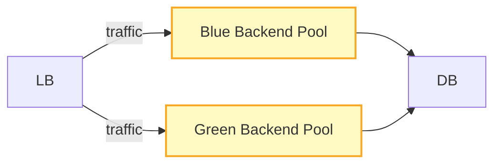

# CHAPTER 7: DEPLOYMENT & OPERATIONS  

> **Goal:** Enable any engineer (or DevOps team) at Al‑Azhar University to reproduce the exact production‑grade environment for the Ares Car Rental platform, from a fresh VM/instance to a fully‑running, monitored, and recoverable service.

---

## 7.1 Infrastructure Map  

**Figure 7.1.a – Physical infrastructure map (NCP cloud)**  

```mermaid
flowchart TB
    %% Cloud provider
    subgraph NCP[National Cloud Platform (NCP)]
        direction TB
        %% VPC & VPN
        subgraph VPC[Virtual Private Cloud]
            direction LR
            VPN[VPN / VPC Peering]:::svc
            LB[Load Balancer<br/>Port 443 (HTTPS)<br/>Health‑probe: /api/health]:::svc
            CDN[CDN (Edge) – Cache static assets]:::svc
        end

        %% Backend tier
        subgraph Backend[Backend Tier]
            direction LR
            B1[Backend Instance 1<br/>dotnet Api (5000)<br/>Health‑probe: /api/health]:::inst
            B2[Backend Instance 2<br/>dotnet Api (5000)<br/>Health‑probe: /api/health]:::inst
            B3[Backend Instance 3<br/>dotnet Api (5000)<br/>Health‑probe: /api/health]:::inst
        end

        %% Database tier
        subgraph DB[Database Cluster]
            direction LR
            DB1[SQL Server Node 1<br/>Port 1433]:::db
            DB2[SQL Server Node 2 (HA)<br/>Port 1433]:::db
        end

        %% Email service
        Email[External Email Service (SMTP)<br/>Port 587]:::svc
    end

    %% Connections
    VPN --> LB
    LB --> B1 & B2 & B3
    B1 & B2 & B3 --> DB1 & DB2
    B1 & B2 & B3 --> Email
    CDN --> LB

    classDef svc fill:#E3F2FD,stroke:#1565C0,stroke-width:2px;
    classDef inst fill:#FFF9C4,stroke:#F9A825,stroke-width:2px;
    classDef db fill:#E8F5E9,stroke:#2E7D32,stroke-width:2px;
```

*Notes*  

* **VPN/VPC** isolates the backend from the public internet; only the Load Balancer (LB) is exposed on port 443.  
* **Health probes** are HTTP GET `/api/health` (backend) and TCP check on 1433 (SQL).  
* **CDN** pulls static assets from the LB (port 443) and caches them at edge locations.  
* **Database cluster** runs a primary‑secondary AlwaysOn availability group (automatic fail‑over).  

---

## 7.2 Prerequisites  

| Platform | Packages | Minimum Versions | Verification Commands |
|----------|----------|------------------|------------------------|
| **Ubuntu 22.04 LTS** | `curl`, `git`, `unzip` (pre‑installed) | – | `lsb_release -a` |
| **Windows 11** | PowerShell 7+, **Chocolatey** | – | `pwsh -v` |
| **macOS 14 (Sonoma)** | **Homebrew** | – | `brew --version` |
| **Common** | **Bun**, **.NET SDK**, **Node.js**, **Docker**, **SQL Server** | Bun ≥ 1.0, .NET ≥ 10.0, Node ≥ 18.0, Docker ≥ 20.10, SQL ≥ 2022 | see below |

### 2.1 Install Bun  

```bash
# Linux / macOS
curl -fsSL https://bun.sh/install | bash
# Windows (PowerShell)
iwr https://bun.sh/install -UseBasicParsing | iex
# Verify
bun --version   # → 1.x.x
```

### 2.2 Install .NET SDK 10  

```bash
# Ubuntu
sudo apt-get update && sudo apt-get install -y dotnet-sdk-10.0

# macOS
brew install --cask dotnet-sdk

# Windows (PowerShell)
choco install dotnet-sdk --version=10.0.0

# Verify
dotnet --list-sdks   # should show 10.0.xxx
dotnet ef --version   # EF tool (installed later)
```

### 2.3 Install Node.js 18+  

```bash
# Ubuntu (using NodeSource)
curl -fsSL https://deb.nodesource.com/setup_20.x | sudo -E bash -
sudo apt-get install -y nodejs

# macOS
brew install node@20

# Windows
choco install nodejs-lts

# Verify
node -v   # ≥ v18.0.0
npm -v
```

### 2.4 Install Docker (optional – used for SQL Server in dev)  

```bash
# Ubuntu
sudo apt-get install -y docker.io
sudo usermod -aG docker $USER

# macOS
brew install --cask docker

# Windows
choco install docker-desktop

# Verify
docker version
docker run hello-world
```

### 2.5 Install SQL Server (Docker preferred for dev)  

```bash
docker run -d \
  --name mssql \
  -e "ACCEPT_EULA=Y" \
  -e "SA_PASSWORD=YourStrong@Passw0rd" \
  -p 1433:1433 \
  mcr.microsoft.com/mssql/server:2022-latest
```

*Verify connection*  

```bash
# Using the built‑in test script
bun run scripts/setup/database/connection.ts
```

### 2.6 Verify All Versions (one‑liner)  

```bash
printf "Bun: %s\n.NET: %s\nNode: %s\nDocker: %s\nSQL: %s\n" \
  "$(bun --version)" "$(dotnet --version)" "$(node -v)" "$(docker --version)" "$(docker exec mssql /opt/mssql-tools/bin/sqlcmd -S localhost -U SA -P YourStrong@Passw0rd -Q 'SELECT @@VERSION')"
```

---

## 7.3 Setup Guide  

> **All commands are shown for Bash (Linux/macOS).** Equivalent PowerShell snippets are provided where the syntax differs.

### 7.3.1 Step 1 – Clone repository & configure environment variables  

```bash
# 1️⃣ Clone the monorepo
git clone https://github.com/azhar-university/ares-car-rental.git
cd ares-car-rental

# 2️⃣ Install the *setup* tooling (Bun)
cd scripts/setup
bun install
cd ../..
```

**PowerShell**  

```powershell
git clone https://github.com/azhar-university/ares-car-rental.git
Set-Location ares-car-rental
cd scripts/setup
bun install
Set-Location ../..
```

### 7.3.2 Step 2 – Database setup (migrations & seeding)  

```bash
# Run the full automated setup (interactive)
bun run setup          # prompts for DB credentials, JWT secrets, etc.

# Quick mode (defaults & auto‑generated secrets)
bun run setup:quick
```

*What the script does*  

1. **System checks** – .NET, Node, Bun, SQL Server, required ports.  
2. **Generates secrets** (`jwtSecret`, `nextAuthSecret`).  
3. **Creates** `backend/.env` and `frontend/.env.local`.  
4. **Tests** DB connectivity (retries 3×).  
5. **Runs EF Core migrations** (`dotnet ef database update`).  
6. **Seeds demo data** (`SEED_DEMO_DATA=true`).  

**Manual alternative** (if you prefer to run each piece yourself):

```bash
# 1️⃣ Restore NuGet packages
dotnet restore backend

# 2️⃣ Apply migrations (ensure .env exists)
cd backend/Api
dotnet ef database update

# 3️⃣ Seed demo data (run once with env flag)
SEED_DEMO_DATA=true dotnet run --project ../Api
```

### 7.3.3 Step 3 – Backend build & run  

```bash
# Build (Release)
cd backend
dotnet build -c Release

# Run (development watch mode)
cd Api
dotnet watch run   # auto‑restart on code changes
```

**PowerShell**  

```powershell
cd backend
dotnet build -c Release
cd Api
dotnet watch run
```

*Backend health check*  

```bash
curl -s http://localhost:5000/api/health | jq .
```

Expected JSON:  

```json
{
  "status":"Healthy",
  "timestamp":"2026-06-27T12:34:56Z"
}
```

### 7.3.4 Step 4 – Frontend build & run  

```bash
# Install deps (if not already done by the global setup)
cd ../../frontend
bun install

# Development server
bun run dev
```

**PowerShell**  

```powershell
cd frontend
bun install
bun run dev
```

*Frontend health check*  

```bash
curl -s http://localhost:3000/api/health
```

Should return `{ "status":"ok" }` (or a 200 OK page).

### 7.3.5 Step 5 – Production containerization with Docker  

> The production image bundles **backend** (ASP.NET Core) and **frontend** (Next.js) as separate containers orchestrated by **Docker Compose**. The compose file lives at `docker-compose.yml` (not shown in the repo excerpt but generated by the setup script).

```bash
# 1️⃣ Build backend image
cd backend
docker build -t ares-backend:latest .

# 2️⃣ Build frontend image
cd ../../frontend
docker build -t ares-frontend:latest .

# 3️⃣ Run compose (creates LB, DB, backend, frontend)
cd ..
docker compose -f docker-compose.yml up -d
```

**Verify**  

```bash
docker compose ps   # all services should be "Up"
curl -s https://<your‑domain>/api/health   # via LB
curl -s https://<your‑domain>/health      # Next.js health endpoint
```

*Dockerfile snippets* (for reference)  

```dockerfile
# backend/Dockerfile
FROM mcr.microsoft.com/dotnet/aspnet:10.0 AS runtime
WORKDIR /app
COPY ./Api/out ./
EXPOSE 5000
ENTRYPOINT ["dotnet", "Api.dll"]
```

```dockerfile
# frontend/Dockerfile
FROM node:20-alpine AS builder
WORKDIR /app
COPY . .
RUN bun install && bun run build

FROM nginx:alpine
COPY --from=builder /app/.next /usr/share/nginx/html
EXPOSE 80
```

---

## 7.4 Monitoring & Observability  

### 7.4.1 Log Aggregation  

| Component | Log Provider | Export Method |
|-----------|--------------|---------------|
| **Backend** | **Serilog → Seq** (or Elastic) | `WriteTo.Seq("http://seq:5341")` in `Program.cs` |
| **Frontend** | **Vercel/Next.js logs** → **Grafana Loki** | `next start` writes to stdout; Loki scrapes container logs |
| **Database** | **SQL Server Auditing** → **Azure Log Analytics** (or local ELK) | Built‑in audit log files |

**Figure 7.4.a – Error‑tracking pipeline**  

```mermaid
flowchart LR
    subgraph App[Application Layer]
        BE[Backend (ASP.NET Core)]:::svc
        FE[Frontend (Next.js)]:::svc
    end
    subgraph Obs[Observability Stack]
        S[Serilog]:::tool
        L[Grafana Loki]:::tool
        P[Prometheus]:::tool
        G[Grafana Dashboard]:::tool
        SE[Sentry]:::tool
    end
    DB[(SQL Server)]:::db

    BE --> S --> SE
    FE --> L --> G
    DB --> P --> G

    classDef svc fill:#E3F2FD,stroke:#1565C0,stroke-width:2px;
    classDef tool fill:#FFF3E0,stroke:#EF6C00,stroke-width:2px;
    classDef db fill:#E8F5E9,stroke:#2E7D32,stroke-width:2px;
```

*Implementation notes*  

* **Serilog** is configured in `backend/Api/Program.cs`:

```csharp
builder.Host.UseSerilog((ctx, lc) => lc
    .WriteTo.Console()
    .WriteTo.Seq("http://seq:5341")
    .WriteTo.Sentry(o => {
        o.Dsn = ctx.Configuration["SENTRY_DSN"];
        o.MinimumEventLevel = LogEventLevel.Error;
    }));
```

* **Prometheus** exporter is added via `AddPrometheusMetrics()` (NuGet `prometheus-net`).  
* **Grafana** dashboards are stored in `ops/grafana/` and imported via `grafana-cli`.  

### 7.4.2 Performance Monitoring  

| Metric | Collector | Visualisation |
|--------|------------|----------------|
| **HTTP latency** (backend & frontend) | Prometheus `http_request_duration_seconds` | Grafana heat‑map |
| **CPU / Memory** per container | cAdvisor → Prometheus | Grafana node‑exporter |
| **SQL query time** | Extended Events → Prometheus exporter | Grafana time‑series |
| **Error rate** | Sentry (backend) + Loki (frontend) | Grafana alerts |

**Alert example (Grafana)**  

```yaml
# Alert rule: Backend error rate > 5/min over 2m
alert: BackendErrorRate
expr: sum(rate(sentry_events_total{level="error"}[2m])) > 5
for: 2m
labels:
  severity: critical
annotations:
  summary: "High backend error rate"
  description: "More than 5 errors per minute on {{ $labels.instance }}"
```

---

## 7.5 Rollback & Recovery Procedures  

### 7.5.1 Blue‑Green Deployment (Kubernetes‑style)  

Even though the production stack runs on plain Docker Compose, the same concept can be applied with two parallel backend groups (`bg‑green` and `bg‑blue`).  



**Deployment steps**  

| Phase | Action |
|------|--------|
| **Prepare** | Build new Docker image `ares-backend:v2`. |
| **Deploy Green** | `docker compose -f docker-compose.green.yml up -d` (creates `bg‑green`). |
| **Smoke Test** | Run health checks against `http://green‑lb.local/api/health`. |
| **Switch** | Update the main LB config (`docker exec lb nginx -s reload`) to point to `bg‑green`. |
| **Monitor** | Verify traffic, error‑rate, latency for 5 min. |
| **Retire Blue** | `docker compose -f docker-compose.blue.yml down`. |

*If anything fails after the switch, revert the LB to the previous pool (Blue) and keep the Green containers stopped.*

### 7.5.2 Manual Rollback Script  

`scripts/setup/rollback.sh` (generated by the setup script)  

```bash
#!/usr/bin/env bash
set -euo pipefail

# 1️⃣ Stop current backend containers
docker compose -f docker-compose.yml down

# 2️⃣ Re‑tag last known‑good image
docker pull ares-backend:stable   # pre‑pushed stable tag
docker tag ares-backend:stable ares-backend:latest

# 3️⃣ Re‑start compose with stable image
docker compose -f docker-compose.yml up -d

# 4️⃣ Verify health
until curl -sf http://localhost:5000/api/health | grep -q Healthy; do
  echo "Waiting for backend health..."
  sleep 2
done

echo "✅ Rollback to stable version completed."
```

> **Run** `bash scripts/setup/rollback.sh` whenever a deployment shows critical failures.

### 7.5.3 Database Recovery  

* **Point‑in‑time restore** – SQL Server AlwaysOn provides automatic backups. To restore to a previous timestamp:  

```sql
RESTORE DATABASE ares
FROM DISK = '/var/opt/mssql/backup/ares_full.bak'
WITH STOPAT = '2026-06-27T10:15:00', RECOVERY;
```

* **Automated script** (`scripts/setup/database/reset.sh`) drops and recreates the DB from the latest backup, then re‑runs migrations and seeding.

```bash
#!/usr/bin/env bash
set -e
docker exec -i mssql /opt/mssql-tools/bin/sqlcmd -S localhost -U SA -P "$SA_PASSWORD" <<SQL
RESTORE DATABASE ares FROM DISK = '/var/opt/mssql/backup/ares_latest.bak' WITH REPLACE;
GO
SQL

# Re‑apply EF migrations
cd backend/Api
dotnet ef database update
```

---

## 7.6 Frequently Asked Questions (FAQ)  

| Question | Answer |
|----------|--------|
| **How do I change the JWT secret after deployment?** | Update `backend/.env` → `JWT_SECRET=…`, then restart the backend (`docker compose restart backend`). Existing tokens become invalid; force users to re‑login. |
| **Can I run the setup on a CI/CD runner?** | Yes. Use the **quick** mode with environment variables pre‑populated: `export DB_PASSWORD=… JWT_SECRET=…; bun run setup:quick --skip‑checks`. |
| **Where are the generated `.env` files stored?** | `backend/.env` and `frontend/.env.local` at the repository root. They are **git‑ignored** by `.gitignore`. |
| **What if port 5000 is already in use?** | The setup script will detect the conflict and ask to kill the occupying process. Manually you can run `lsof -ti:5000 | xargs kill -9` (Linux/macOS) or `Get-Process -Id (Get-NetTCPConnection -LocalPort 5000).OwningProcess | Stop-Process -Force` (PowerShell). |
| **How to add a new micro‑service?** | Add a new Docker service definition, expose its health endpoint, and extend the **blue‑green** LB config. Update `Figure 7.1.a` accordingly. |

---

## 7.7 Summary Checklist  

```text
[ ] OS & architecture verified
[ ] Bun, .NET SDK, Node.js installed
[ ] SQL Server reachable (port 1433)
[ ] Required ports (5000, 3000) free
[ ] Secrets generated & stored in .env files
[ ] Database migrations applied
[ ] Demo data seeded (optional)
[ ] Backend built & health‑checked
[ ] Frontend built & health‑checked
[ ] Monitoring stack (Serilog, Prometheus, Grafana, Sentry) configured
[ ] Blue‑green deployment ready
[ ] Rollback scripts tested
```

When the checklist is green, the Ares Car Rental platform is **production‑ready** and can be handed over to the operations team at Al‑Azhar University.  

---  

*End of Chapter 7.*